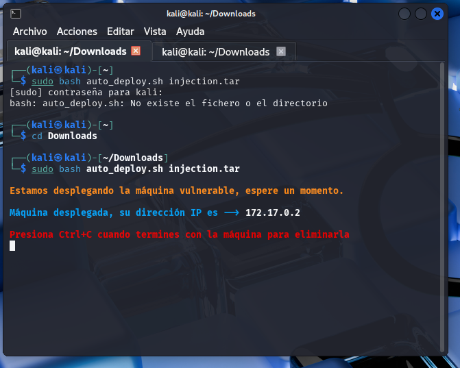
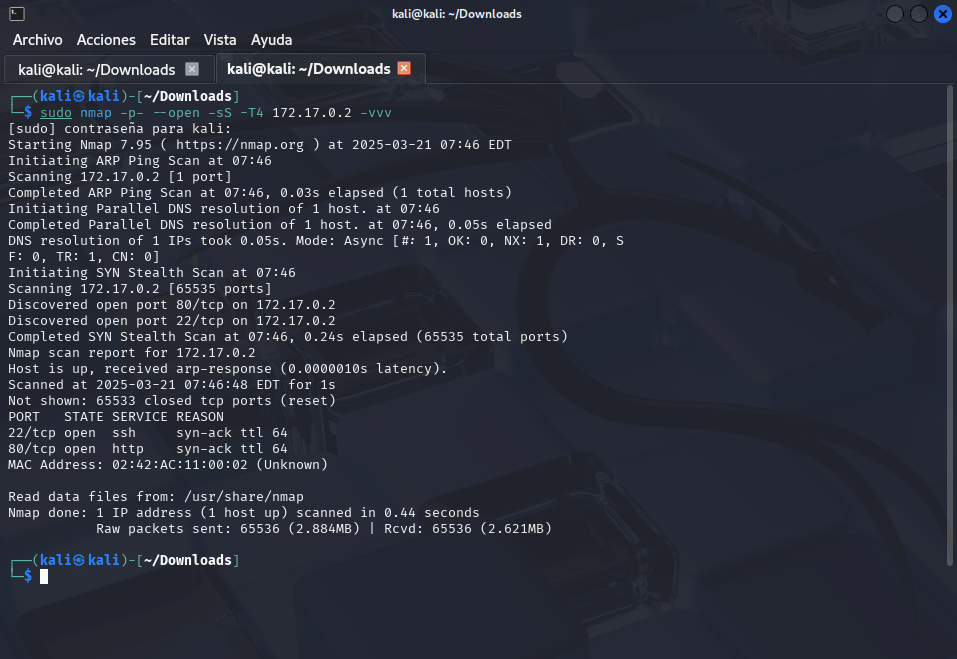

# 💉 Inyección

<mark style="color:blue;">**En primer lugar debemos de desplegar la máquina que se nos proporciona en :**</mark>



<mark style="color:blue;">**Una vez desplegada la máquina se nos asignará una IP en este caso es 172.17.0.2**</mark>

<figure><figcaption></figcaption></figure>

<mark style="color:blue;">**A continuación se va a realizar un escaneo de puertos, para ello se deberá de ejecutar el siguiente comando:**</mark>

```
sudo nmap -p- --open -sS -T4 172.17.0.2 -vvv
```

* **sudo**\
  Ejecuta el comando con privilegios elevados (root).&#x20;
* **nmap**\
  Es la herramienta que realiza el escaneo de puertos y descubrimiento de hosts.
* **-p-**\
  Indica a Nmap que escanee **todos los puertos TCP (1 al 65535)**. Por defecto, si no se especifica, Nmap escanea solamente los puertos más comunes.
* **--open**\
  Le dice a Nmap que muestre **únicamente** los puertos que estén en estado “abierto” (open). No mostrará los que estén cerrados o filtrados.
* **-sS**\
  Realiza un **escaneo SYN** (conocido como “escaneo sigiloso” o “stealth scan”). Envía paquetes SYN y evalúa la respuesta:
  * Si recibe SYN+ACK, el puerto se considera abierto.
  * Si recibe RST, el puerto se considera cerrado.
  * Si no recibe respuesta o recibe un error ICMP de destino inalcanzable, el puerto se considera filtrado.
* **-T4**\
  Especifica una **plantilla de tiempo** o agresividad del escaneo. Cuanto mayor es el número, más rápido y agresivo será el escaneo. `-T4` se considera bastante rápido/agresivo y puede ser suficiente en la mayoría de redes sin causar demasiados problemas.
* **172.17.0.2**\
  Es la **dirección IP** del objetivo que se va a escanear.
* **-vvv**\
  Aumenta el nivel de **verbosidad**. Nmap mostrará mucha más información detallada acerca de su progreso y los resultados del escaneo.

<figure><figcaption></figcaption></figure>

A continuación, se ejecutará el siguiente comando con objetivo de descubrir recursos o rutas ocultas en un sitio web que de otra forma no aparecerían en los enlaces normales.&#x20;

* **gobuster dir**\
  Indica que se va a utilizar la función de **búsqueda de directorios y archivos** (modo `dir`) de Gobuster.
* **-u** [**http://172.17.0.2**](http://172.17.0.2)\
  Especifica la **URL objetivo**. En este caso, Gobuster buscará en el host `172.17.0.2` (puede ser una máquina local o remota).
* **-w /usr/share/wordlists/dirbuster/directory-list-2.3-medium**\
  Indica la **ruta al archivo de diccionario** que se va a usar para “fuerza bruta” de directorios y archivos. Este diccionario contiene una lista de posibles nombres de directorios/archivos.
* **-x php,html,txt**\
  Le dice a Gobuster que **pruebe** esos nombres de la lista **con las extensiones** `.php`, `.html` y `.txt`. Así, cada entrada del diccionario se combinará con esas extensiones (por ejemplo, `admin.php`, `admin.html`, `admin.txt`, etc.).

En resumen, este comando **enumerará** (buscará) directorios y archivos en la dirección `http://172.17.0.2`, utilizando el diccionario especificado y probando con las extensiones `.php`, `.html` y `.txt`.&#x20;

<figure><figcaption></figcaption></figure>

<mark style="color:blue;">Hay que tener en cuenta que para poder acceder a la máquina con el usuario en este caso hay varias formas .</mark>

***

### Primer Método: Inyección SQL (Navegador)

Se puede observar como está abierto el puerto 22 correspondiente al ssh y el puerto 80 correspondiente al http. Vamos a ir en este caso a **Firefox > Ingresar IP máquina objetivo** en el navegador.

<figure><figcaption></figcaption></figure>

Una vez puesta la IP en el navegador, se nos va a redirigir a la página de **Login.**

<figure><figcaption></figcaption></figure>

En esta parte vamos a rellenar el campo User con la siguiente sentencia SQL:

El fragmento `' OR 1=1 -- -` (o variantes como `OR 1=1`) es un ejemplo clásico de **inyección SQL**. La idea es que, al incluirlo en un campo de entrada (por ejemplo, en un campo de nombre de usuario), se modifique la lógica de la consulta para que siempre sea verdadera, o que se ignore parte del código (usando `--` como comentario en SQL).

<figure><figcaption></figcaption></figure>

Ya estamos dentro!!

<figure><figcaption></figcaption></figure>


### Segundo Método: Entrar en la propia base de datos

En parte debemos de tener en cuenta de que  tenemos que listar todos los puertos y en este caso encontrar el puerto correspondiente a la base de datos que es el 3306.

<figure><figcaption></figcaption></figure>

El comando `ss -tunlp`  sirve para **visualizar las conexiones de red (sockets) que están escuchando** en el sistema, mostrando puertos TCP/UDP, sin resolver nombres de host, y enlazando cada socket a su correspondiente proceso. A continuación se detallan sus parámetros:

* **-t**: Muestra únicamente sockets TCP.
* **-u**: Muestra únicamente sockets UDP.
* **-n**: No realiza la resolución de nombres de dominio (IP y puertos se muestran en formato numérico).
* **-l**: Muestra solo los sockets que se encuentran en estado de escucha (_listening_).
* **-p**: Muestra la información del proceso asociado al socket (PID y nombre).


Posteriormente se ejecutará el comando para poder conectarnos a MariaDB:

```
mysql -h localhost -u root -p
```

(la opción `-p` pide la contraseña “paso” en el ejemplo).

Al ejecutar el siguiente comando se listas todas las bases de datos disponible:

<pre><code><strong>show databases;
</strong></code></pre>

A continuación vamos a realizar la siguientes sentencia para cambiar a la base de datos register , la cual tiene pinta de que no está creada por defecto. Para ello ejecutamos:

```
use register;
```

Finalmente, con:

```
use register;
```

Se observa la estructura (campos y tipos) de la tabla `users`, que en este caso tiene:

* **username** (varchar(30), NOT NULL, PRIMARY KEY)
* **passwd** (varchar(30))


<figure><figcaption></figcaption></figure>

Se ejecutan las siguientes consultas  dentro de la base de datos register:

* `SELECT * FROM users;`
  * Muestra **todas** las columnas de la tabla `users`.
  * Aparece un único registro, con la columna `username` = `dylan` y la columna `passwd` = `KJSDFG789FGSDF78`.
* `SELECT username, passwd FROM users;`
  * Es exactamente la misma información, pero se han especificado las columnas a mostrar (en lugar de usar `*`).
  * Nuevamente, se visualiza la fila con los mismos datos de usuario y contraseña.

<figure><figcaption></figcaption></figure>

***


A continuación se realizará el siguiente comando con el objetivo de buscar **un binario con el bit SUID** (`/usr/bin/env`).

```
find / -perm -4000 2>/dev/null
```

* Este comando lista todos los binarios que tienen el bit SUID (setuid) activo. En el resultado aparece, entre otros, `/usr/bin/env`.

Con el siguiente comando&#x20;

* **Segundo intento: `/usr/bin/env /bin/sh -p`**
  *   Se utiliza para **invocar** el intérprete de comandos (`/bin/sh`) **a través** de la utilidad `env`, pero con la opción `-p`. En muchos sistemas, esta opción (`-p`) indica a la shell que **no “baje” o descarte privilegios** al arrancar. Si, por ejemplo, `env` tiene el bit SUID activo y pertenece a root, la shell que se inicia con `-p` conservará los privilegios de root.

      En otras palabras, si `/usr/bin/env` está configurado como SUID (propietario root, con permiso `rwsr-xr-x`), al ejecutarlo con:

```
/usr/bin/env /bin/sh -p
```

#### La shell resultante se inicia con **privilegios de root**, permitiendo una **escalada de privilegios**.

#### ¿Por qué ocurre?

* **SUID** (Set User ID) hace que cuando un binario se ejecute, adopte los privilegios de su propietario (root, en este caso).
* Muchas shells (como Bash) detectan cuando se inician con SUID y descartan esos privilegios por seguridad.
* Con `sh -p`, se usa el “modo privilegiado”: la shell no descarta los privilegios y, por tanto, se mantiene con permisos de root.
* `env` está en la lista de binarios que, si tienen el bit SUID, pueden usarse para lanzar otros programas con privilegios elevados (lo encontrarás en listados como GTFOBins).

Así, `/usr/bin/env /bin/sh -p` se convierte en un método para obtener una shell con privilegios de root en entornos donde `env` está mal configurado con SUID.

<figure><figcaption></figcaption></figure>



Consejo

Siempre es bueno revisar el código fuente de la propia página(contr+u) como también el menú de inspeccionar( consola, cookies,etc)


<figure><figcaption></figcaption></figure>

<figure><figcaption></figcaption></figure>

