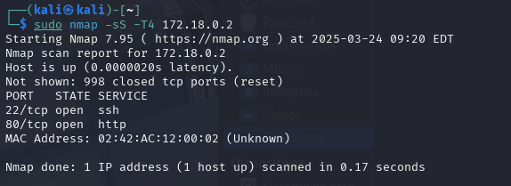

# 💩 Trust

Descargamos y descomprimimos el&#x20;

```
unzip trust.zip
```

Ponemos la máquina en marcha con el siguiente comando:

```
sudo bash ./auto_deploy.sh ./trust.tar
```

Lo primero de todo vamos a realizar un escaneo de puertos para saber que puertos están abiertos:

```
sudo nmap -sS T4 172.18.0.2
```

<figure><figcaption></figcaption></figure>

Podemos realizar el siguiente comando para  identificar y mostrar características de un sitio web o un servidor web dado. WhatWeb puede detectar información como:

* Tecnologías que emplea el sitio (p. ej., tipo de servidor web, lenguaje de programación, frameworks, etc.).
* Versión del servidor web (por ejemplo: Apache 2.4.57).
* Sistema operativo en el que se está ejecutando (por ejemplo: Debian Linux).
* Encabezados HTTP y título de la página.
* Posible ubicación o país asociado a la IP (aunque, en este caso, “RESERVED” indica que es una IP privada o no pública).

```
whatweb 172.18.0.2
```

<figure><figcaption></figcaption></figure>

Realizamos un gobuster la listar los directorios ocultos de la propia web:

```
gobuster dir -u http://172.18.0.2/ -w /usr/share/wordlists/dirbuster/directory-list-2.3-medium.txt -x php,html,txt
```

<figure><figcaption></figcaption></figure>

Podemos verificar si hay algún directorio en la propia url de web.

```
172.18.0.2/secret.php
```

A continuación vamos a realizar un ataque de fuerza bruta con la herramienta hydra:

El comando va a buscar una contraseña que coincida con el nombre usuario , y si encuentra una válida de la dará

```
sudo hydra -l mario -P /usr/share/wordlists/rockyou.txt 172.18.0.2 ssh
```

1. **Herramienta “Hydra”**:\
   Es una herramienta de fuerza bruta para probar credenciales en varios protocolos (SSH, FTP, HTTP, etc.).
2. **Opción `-l mario`**:\
   Indica el **nombre de usuario** que se va a usar en todos los intentos (en este caso, `mario`).
3. **Opción `-P /usr/share/wordlists/rockyou.txt`**:\
   Especifica **un archivo** que contiene miles (o millones) de posibles contraseñas (un diccionario). Hydra usará cada contraseña de ese archivo para los intentos de autenticación.
4. **Objetivo `172.18.0.2 ssh`**:\
   Hydra se dirigirá al servicio **SSH** en la dirección IP `172.18.0.2`, tratando de iniciar sesión con el usuario `mario` y cada contraseña del diccionario.

En resumen, el comando **intenta descubrir la contraseña correcta** para el usuario `mario` en el servicio SSH de la dirección `172.18.0.2`, usando todas las contraseñas listadas en `rockyou.txt`. Este es un típico ataque de fuerza bruta/diccionario para fines de pentesting o auditoría de seguridad.

<figure><figcaption></figcaption></figure>

Una vez obtenida la contraseña realizamos la conexión ssh con el usuario y la contraseña.

<figure><figcaption></figcaption></figure>

Escalada de privilegios:

Podemos realizar una vez realizado el ssh y conectado con el usuario el comando :

El comando `sudo -l` (sin parámetros adicionales) **muestra los privilegios de `sudo`** para el usuario que lo ejecuta. En otras palabras, lista:

1. **A qué comandos puede acceder el usuario con `sudo`**,
2. **Bajo qué condiciones** (por ejemplo, si requiere una contraseña o no),
3. **Con qué usuarios puede hacer `sudo`** (normalmente `root`, aunque puede ser otro).

Si ejecutas `sudo -l`, el sistema te pedirá (o no) la contraseña (dependerá de la configuración) y luego te mostrará algo parecido a:

```
sudo -l
```

Una vez listado  el binario podemos dirigirnos a l página de GTFOBINS y dentro podemos irnos a vim y sudo. Para que nosotros podamos acceder mediante el binario a ser root tenemos que acceder a la página web y copiamos el binario(vim).

**GTFOBins** ([https://gtfobins.github.io/](https://gtfobins.github.io/)) es un recurso muy útil en auditorías o pruebas de penetración. El sitio muestra diferentes binarios y cómo pueden aprovecharse para escalar privilegios o escapar de entornos restringidos (como un shell con privilegios limitados). En el caso de `vim`, si se tiene la posibilidad de ejecutarlo con `sudo` sin contraseña (por ejemplo, apareciendo en la salida de `sudo -l` con `NOPASSWD`), se puede **obtener acceso root** de forma sencilla.



Listo!!! :smile:

<figure><figcaption></figcaption></figure>
